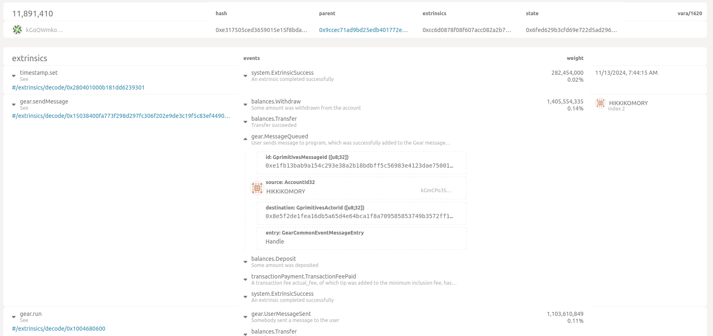

# Hikkikomory Tamagochi

Hikikomori is a software and hardware project to act like a digital pet of yours. You can think of it as a [tamagotchi toy](https://en.wikipedia.org/wiki/Tamagotchi) but it’s meant to be linked with your smart home system on [Home Assistant](https://www.home-assistant.io/) . When you interact with your smart home or an automation is triggered the Hikikomori gets happier. Also it’s able to interact with Robonomics and Vara networks - that’s where the soul of the toy lives. Hikikomori sends its digital copy to Robonomics from time to time. There is a logic of tamagotchi in Vara network, it’s used to make computations of the level of happiness

Here’s the link to the tamagotchi [smart contract from Vara network](https://idea.gear-tech.io/programs/0x8e5f2de1fea16db5a65d4e64bca1f8a709585853749b3572ff15487db2146771?node=wss%3A%2F%2Ftestnet.vara.network).

The code is tested with a simple scenario of increasing the happiness level in Vara by sending messages from Hikikomori. Please have a look at the testing transaction and it’s output om [Polkadot.js Portal](https://polkadot.js.org/apps):



Transaction hash in block № 11891410:
```
0xb07dc6d65cb2ab972e8bd372285a51897f0d54d6b05609367f54dcea166de56d
```

## Requirements

* ESP-IDF v5.1.4
* Home Assistant
* Zigbee2MQTT

## Flash ESP

### Setup

Set settings in menuconfig:
```bash
idf.py menuconfig
```
* In `Component config -> mbedTLS -> TLS Key Exchange Methods -> Enable pre-shared-key ciphersuites` check `Enable PSK based cyphersuite modes`.

* In `Component config -> ESP System Settings` set `Event loop task stack size` to 4096.

Save and quit.

In sdkconfig set 
```
CONFIG_FREERTOS_HZ=1000
```

### Build and flash

Connect the esp viz USB and run

```bash
idf.py -p <PORT> build flash
```

## Prepare Home Assistant

### Zigbee2MQTT

In Zigbee2MQTT `data` folder create a file `hikkikomory.js` with the following content

```
const {onOff, identify} = require('zigbee-herdsman-converters/lib/modernExtend');

const definition = {
    zigbeeModel: ['esp32c6'],
    model: 'esp32c6',
    vendor: 'Robonomics',
    description: 'Automatically generated definition',
    extend: [onOff({"powerOnBehavior":false}), identify()],
    meta: {},
};

module.exports = definition;
```
And add this to `configuration.yaml`:
```
external_converters:
    - hikkikomory.js
```
Then restart Zigbee2MQTT.

## Use

### Initial Setup and Configuration

When you start Hikkikomory for the first time, it will set up an Access Point. Follow these steps to configure it:

* Connect to the Access Point:
    Connect your device to the WiFi network broadcasted by Hikkikomory.
    Open a web browser and navigate to http://192.168.4.1.

* Enter WiFi Credentials:
    Fill in the required information about your WiFi network.
    Save the settings.

### Pairing Mode

After setting the WiFi credentials, Hikkikomory will enter pairing mode. This allows you to connect it to Zigbee2MQTT. Follow the specific Zigbee2MQTT instructions to complete the pairing process.

### Operation

**Identify Button in Home Assistant**:

Pressing the identify button will increase the happiness level of Hikkikomory.

**Left Button on ESP**:

- Short Press: Toggles Hikkikomory between sleep mode and wake mode.
- Long Press: Resets Hikkikomory to its default settings.