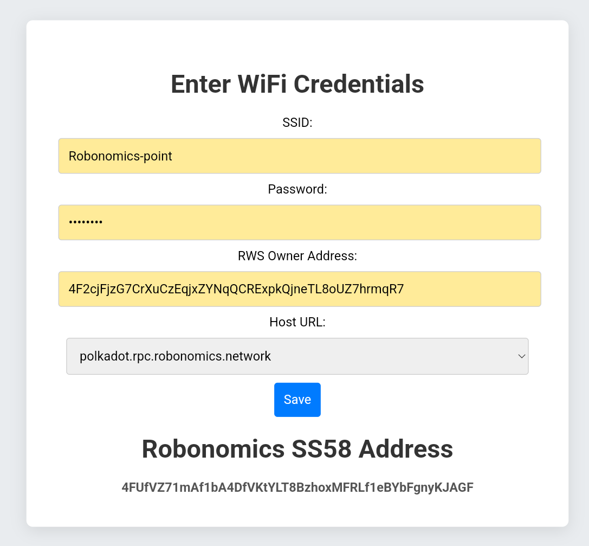

# Hikikomory Tamagotchi

## Flashing the Firmware

To flash your Hikikomory ESP32C6 device, use the [Web Flasher Tool](https://espressif.github.io/esptool-js/).

1. **Connect the Device**  
   Plug the Hikikomory device into your computer via USB and click the `Connect` button.  

   

2. **Select the Device**  
   Choose the ESP device from the list. It should appear similar to the example below.  

   

3. **Upload Firmware**  
   Upload the files from the [builds](./builds) folder. For each file, set the `Flash Address` as shown in the image below. Once done, press `Program` and wait for the flashing process to complete.  

   

---

## Setting Up the Hikikomory Tamagotchi

After flashing, the Hikikomory device will enter setup mode. You’ll see the following screen:  


1. **Connect to the Access Point**  
   The device will create a Wi-Fi access point named `Hikkikomory-Tamagotchi`. Connect to this network.  

2. **Open the Web Interface**  
   In your browser, navigate to `192.168.4.1`. Fill in the required fields on the setup page.  

3. **Setup Your Device**  
   At the bottom of the page, you’ll find your device's address in the Robonomics Network. Make sure to add it to the `RWS devices` section of your `RWS Owner Address`.  

   

4. **Save Settings**  
   Press the `Save` button to complete the setup.

---

## Using the Hikikomory Tamagotchi

The Hikikomory device can count button presses and send Datalog transactions with messages like `Button was pressed n times`.

1. **Increase the Counter**  
   A short button press increments the counter.  

   

2. **Send a Datalog Transaction**  
   Hold the button for 2–3 seconds to send a Datalog transaction. Afterward, the device will display the transaction hash and a QR code linking to the transaction on [Subscan](https://robonomics.subscan.io).  

   

## Manual Build

### Requirements

* ESP-IDF v5.1.4

### Build

```bash
idf.py -p <PORT> build flash
```