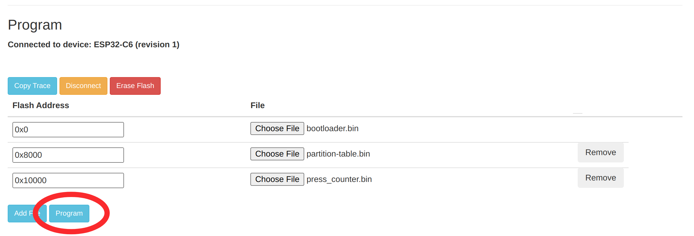

# Hikkikomory Tamagotchi

## Flash Firmware

You can flash your Hikkikomory esp32c6 device using [Web Flasher Tool](https://espressif.github.io/esptool-js/).

Connect Hikkikomory to the computer via USB and press `Connect` button.


Choose esp device (it will looks like in the picture)


Then upload files from the [builds](./builds) folder and set `Flash Address` like shown in the picture below. After that press Program and wait till the end of the flashing progress.



## Setup Hikkikomory Tamagotchi

After flashing firmware Hikkikomory will enter setup mode. On its screen you will see


It will create wifi access point named `Hikkikomory-Tamagotchi`. Connect to it and in your browser open `192.168.4.1` address. Fill in the fields.

In the end of the page is your device address in Robonomics Network. Don't forget to add it to RWS devices of `RWS Owner Address`.


Press `Save` button.

## Use Hikkikomory Tamagotchi

Hikkikomory can count button press and send Datalog transaction with the following text `Button was pressed n times`.

On short button press counter will increase:


Hold button on 2-3 seconds to send the datalog transaction. After that you will see transaction hash and QR code with the link to this transaction on [subscan](https://robonomics.subscan.io):


## Manual Build

### Requirements

* ESP-IDF v5.1.4

### Build

```bash
idf.py -p <PORT> build flash
```